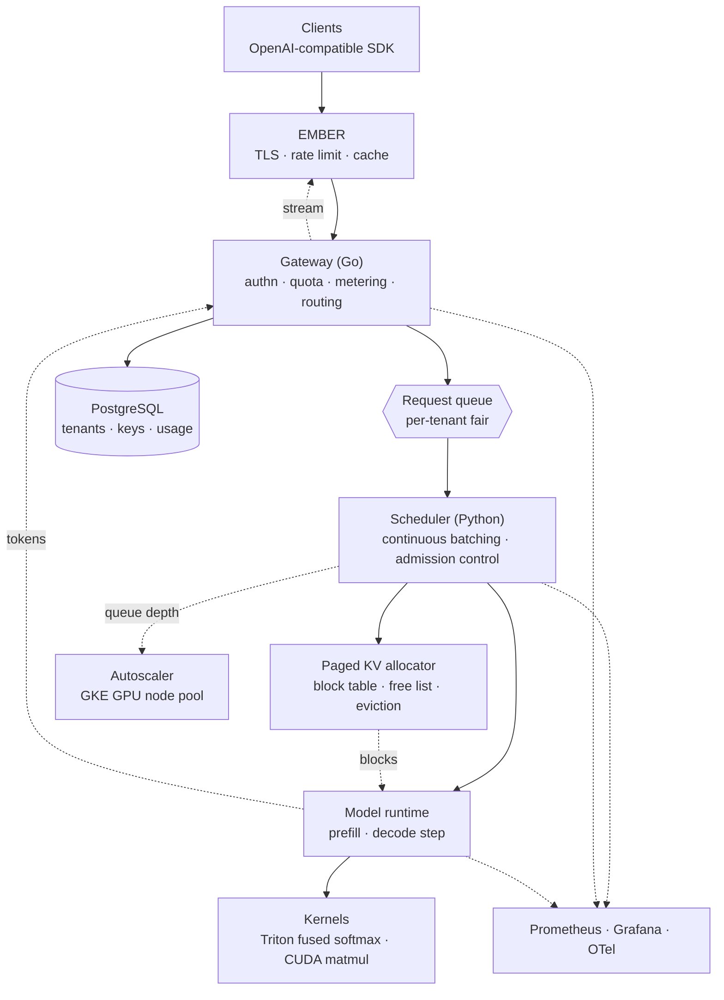

# TESSERA — LLM Inference Platform

<div align="center">


[](https://github.com/nickemma/tessera/actions)

**A multi-tenant LLM inference platform with a serving core written from scratch — and benchmarked against vLLM without flattering itself.**

_Paged KV cache. Continuous batching. Not a vLLM wrapper. The numbers get published beside vLLM's on identical hardware, including the places this loses and precisely why._

[Architecture](#architecture) • [Decisions](docs/decisions/) • [Benchmarks](docs/benchmarks.md) • [Threat model](docs/threat-model.md) • [Runbook](docs/runbook.md) • [Roadmap](#roadmap)

</div>

---

## Project Status

> **Nothing is built.** This repository contains a design derived from a frozen charter.
> If you clone this expecting an inference server, you will be disappointed — for now. The design target is in [the charter](https://github.com/nickemma/Nicholas-Engineering-Blueprint/blob/main/docs/part-6-flagships/tessera.md). Its performance targets are commitments made before the build, scored afterward, and never revised to match what shipped.

| Behavior | State |
|---|---|
| B1 · A net that trains, with backprop derived by hand | Not started |
| B2 · A small transformer trains; loss curve interpretable | Not started |
| B3 · A CUDA tiled matmul, occupancy explained via Nsight | Not started |
| B4 · Fused softmax in Triton beating naive PyTorch | Not started |
| B5 · Paged KV allocator, budget computed before it was written | Not started |
| B6 · Continuous batching: throughput climbs, TTFT flat | Not started |
| B7 · Streaming; a GPU dying mid-stream corrupts nothing | Not started |
| B8 · Tenants, keys, quotas, metering, queue-depth autoscaling | Not started |
| B9 · Numbers beside vLLM's, losses explained | Not started |

---

## What is TESSERA?

Serving a language model looks like a web service and behaves like nothing of the sort. A web request is stateless, short, and its cost is knowable before you accept it. A generation request holds gigabytes of GPU memory for an unpredictable duration, grows that footprint with every token it emits, and cannot be evicted without discarding all the work already done. The entire discipline of inference serving comes from that difference.

TESSERA is a multi-tenant platform for that workload, whose serving core is written rather than imported.

The first bet is that **KV cache memory, not compute, is the resource being scheduled.** During decode a GPU is memory-bandwidth-bound and largely idle on arithmetic; what runs out is the attention cache. For a model with `L` layers, `H` KV heads, head dimension `D`, in 2-byte precision, a single sequence consumes `2 · L · H · D · tokens` bytes for as long as it lives. Naive contiguous allocation reserves for the worst case and fragments immediately, which is why most of a naive server's GPU memory is reserved and unused. Paging it into fixed blocks is what makes the rest of the system possible — and it is a memory allocator problem, not a machine-learning one. The LSM instincts from [LATTICE](https://github.com/nickemma/lattice) transplant almost directly.

The second bet is **admission control over OOM.** A CUDA out-of-memory during decode does not fail the request that caused it; it fails the entire batch, including thirty-one other tenants' requests that were behaving perfectly. So the scheduler must refuse work it cannot finish rather than discover mid-flight that it can't. Every admission is a claim on a known number of KV blocks, and a request whose next allocation cannot be guaranteed is queued rather than started.

The third bet is that **multi-tenant fairness on a GPU is scheduling, not rate limiting.** A request-per-second limit is meaningless when one tenant's 8k-token prompts consume forty times the KV pages of another's. The budget that has to be fair is blocks and decode slots, enforced in the scheduler, not requests counted at the gateway.

The fourth is **honesty as the deliverable.** vLLM is written by people who do this full time, and a hand-built core will lose on several axes. Publishing where, by how much, and through what mechanism is worth more than a benchmark that wins by choosing its conditions — and it is the only version of this project that survives contact with someone who actually works on inference.

**The real question this system answers:** what happens to the other thirty-one requests in the batch when one of them runs out of KV cache? TESSERA's answer is that it never gets that far, and the admission path is where you can go read why.

---

## What Each Layer Proves

| Layer | What It Demonstrates |
|---|---|
| Backprop derived by hand | You understand what the framework is doing, not just how to call it |
| A transformer trained from scratch | Attention mechanics and the origin of the KV cache, not an API surface |
| A CUDA kernel with occupancy analysis | GPU architecture — SIMT, warps, memory hierarchy — at the level that changes decisions |
| A fused Triton kernel, benchmarked | Kernel fusion and numerical stability as engineering, with a measured delta |
| Paged KV allocator | The insight that inference serving is a memory allocator problem |
| KV budget computed before the code | You size a system with arithmetic instead of discovering the ceiling in production |
| Continuous batching scheduler | The hardest scheduling problem in the portfolio, and the reason throughput and TTFT decouple |
| Admission control | Refusing work you cannot finish — the difference between a platform and a demo |
| Per-tenant fair scheduling on blocks | Multi-tenancy on a scarce, non-preemptible resource |
| Published loss analysis vs vLLM | Benchmark honesty, which is rarer and more valuable than benchmark skill |

---

## Architecture

> **Design target.** Nothing below exists yet.



**Two languages, split at the queue.** Go owns the gateway and control plane — auth, quota, metering, fleet, autoscaling — where the work is orchestration and a static binary is a virtue. Python owns the serving core, because that is where PyTorch, Triton, and CUDA live and any other choice means reimplementing a model runtime for no benefit. The boundary is real rather than a smear: nothing in `core/` knows what a tenant is.

---

## The Serving Loop

The naive model treats generation as a request handler:

```
Request → load model → generate all tokens → respond
```

That model wastes most of the GPU. Requests arrive at different times, finish at different times, and a static batch runs at the speed of its slowest member while newly-arrived requests wait for the whole batch to drain.

```
                    ┌──────────────── every decode step ───────────────┐
                    │                                                   │
  arrivals ──→ queue ──→ admission ──→ running batch ──→ decode ──→ emit
                    │        │              ▲              │          │
                    │        │              └──────────────┘          │
                    │        │           (finished sequences leave,   │
                    │        │            queued ones join, mid-flight)│
                    │        ▼                                         │
                    │   can I guarantee                                │
                    │   this sequence's next                           │
                    │   KV block? ─── no ──→ stays queued              │
                    └───────────────────────────────────────────────────┘
```

Three properties fall out:

- **A finished sequence frees its slot immediately.** It does not wait for the batch. Throughput stops being hostage to the longest generation in the group.
- **A new request joins mid-flight.** Time-to-first-token stays roughly flat as throughput climbs, which is the whole reason continuous batching exists.
- **Admission is a memory decision, not a queue-length one.** A sequence starts only if its next block can be guaranteed. This is what makes "no OOM under pressure" a design property rather than a hope.

---

## The Four Pillars

### 1. Paged KV Cache — `core/kv/`

The allocator the rest of the system stands on.

- **Fixed-size blocks** — a sequence's cache is a list of block indices, not a contiguous reservation
- **Block table per sequence** — indirection is what makes non-contiguous attention possible
- **Free list with O(1) allocation** — the hot path runs every decode step
- **Copy-on-write for shared prefixes** — identical system prompts across tenants share blocks until they diverge
- **The budget is arithmetic, published** — `docs/kv-math.md` computes total blocks for the served model and GPU before a line of allocator code exists

### 2. Continuous Batching Scheduler — `core/scheduler/`

The hardest build in the portfolio.

- **Per-step batch composition** — the running set is recomputed every decode step, not per request
- **Admission control** — a sequence is admitted only if its next block allocation can be guaranteed
- **Per-tenant fair share on blocks** — not on requests, because requests are not the scarce thing
- **Preemption and recompute** — a low-priority sequence can be evicted and its prefill replayed, which is cheaper than holding blocks it isn't using
- **Prefill/decode interleaving** — prefill is compute-bound and decode is memory-bound; mixing them is where the throughput is

### 3. Gateway & Control Plane — `cmd/tessera-gateway/`, `internal/modules/`

Go, modular monolith, ports and adapters.

- **OpenAI-compatible surface** — `/v1/completions`, `/v1/chat/completions`, streaming, because compatibility is free adoption
- **API keys hashed with scopes** — the database leaking must not be a credential leak
- **Usage metering** — tokens in, tokens out, wall time, attributed cost per tenant per request
- **Queue-depth autoscaling** — GKE GPU node pools scale on queue depth, not CPU, because CPU tells you nothing here
- **Spot discipline** — preemption notice triggers drain, not death

### 4. Kernels & Benchmarking — `core/kernels/`, `bench/`

- **One CUDA kernel written by hand** — a tiled matmul, profiled in Nsight, occupancy explained. Not for production; for the right to reason about the ones that are
- **Triton for everything real** — fused softmax first, benchmarked against naive PyTorch with the delta published
- **vLLM baseline on identical hardware** — same GPU, same model, same workload, same measurement window
- **Loss analysis** — every axis where TESSERA is slower, with the mechanism named. This section is the deliverable

---

## Tech Stack

| Layer | Technology | Why |
|---|---|---|
| **Gateway + control plane** | Go 1.25 | Orchestration, streaming fan-out, static binary. The portfolio's primary language, used where it belongs |
| **Serving core** | Python 3.12 | PyTorch, Triton, and CUDA tooling live here. Any other choice means reimplementing a model runtime for nothing |
| **Kernels** | Triton, plus one hand-written CUDA | Triton is the pragmatic path; the CUDA kernel exists to earn the right to reason about the Triton ones |
| **Model runtime** | PyTorch | The serving core is the contribution. Rewriting the runtime is not |
| **Control plane store** | PostgreSQL | Tenants, keys, usage events. Transactional metering, ordinary requirements |
| **GPU orchestration** | GKE + GPU node pools | Queue-depth autoscaling and spot capacity are the two levers that decide cost |
| **Baseline** | vLLM | The comparison that makes the numbers mean something |
| **Observability** | Prometheus · Grafana · OpenTelemetry | Traces spanning gateway → queue → scheduler → kernel are the only way to attribute latency |

---

## Service Level Objectives

Seeded from charter point 4, scored at level exit. Mirrored in the blueprint's `calibration.md`.

> **These need numbers before the charter freezes.** The charter currently says "competitive with vLLM," which is unfalsifiable and is the single most important claim in this repository. Replace each `—` with a figure you are willing to be scored against, and be willing to lose the bet. Making no bet is the only unacceptable option.

| SLI | Definition | Target | Measured |
|---|---|---|---|
| **Throughput vs vLLM** | Output tokens/sec, batch 32, 512-token prompts, identical GPU | — × | — |
| **TTFT vs vLLM** | Time to first token, batch 1 | within — ms | — |
| **TTFT under load** | p95 at target throughput | < — ms | — |
| **KV utilization** | Blocks in active use ÷ blocks allocated, steady state | > — % | — |
| **OOM under KV pressure** | CUDA OOM events during decode | **0** | — |
| **Cross-tenant fairness** | Block-share deviation from entitlement, p95 | < — % | — |
| **GPU kill mid-stream** | Other tenants' streams affected | **0** | — |
| **Cost per 1M tokens** | USD, published with instance type and utilization | — | — |

The two zeros are invariants, not percentiles. An invariant with an error budget is not an invariant.

---

## Metrics

| Metric | Type | Labels | Question it answers |
|---|---|---|---|
| `tessera_request_duration_seconds` | histogram | phase (queue/prefill/decode), tenant | Where is the time going? |
| `tessera_ttft_seconds` | histogram | tenant, batch_size | Is batching hurting first-token latency? |
| `tessera_tokens_total` | counter | tenant, direction | What are we actually serving, and to whom? |
| `tessera_kv_blocks_allocated` | gauge | — | How close to the wall are we? |
| `tessera_kv_blocks_free` | gauge | — | Will the next admission succeed? |
| `tessera_kv_utilization_ratio` | gauge | — | Is paging actually earning its complexity? |
| `tessera_admission_decisions_total` | counter | decision, reason | Are we queuing on memory or on compute? |
| `tessera_batch_size` | histogram | — | Is the scheduler filling batches or starving? |
| `tessera_preemptions_total` | counter | tenant, reason | How often are we paying recompute cost? |
| `tessera_queue_depth` | gauge | tenant | Do we need more GPUs, or one tenant less? |
| `tessera_queue_wait_seconds` | histogram | tenant, priority | Is fair share actually fair? |
| `tessera_gpu_utilization_ratio` | gauge | node | Is the GPU busy or waiting on memory? |
| `tessera_model_forward_duration_seconds` | histogram | phase | Is the kernel the bottleneck, or the scheduler? |
| `tessera_spot_preemptions_total` | counter | node | What is spot actually costing in disruption? |

Latency is decomposed into queue, prefill, and decode rather than reported end to end, because "inference is slow" is not actionable and "queue wait p95 tripled while GPU utilization fell" points directly at admission control.

---

## Failure Mode Analysis

| Failure | Blast radius | Detection | Mitigation |
|---|---|---|---|
| KV blocks exhausted | Would be the whole batch | Free-block gauge below threshold | Admission refuses new sequences; queued, not started |
| GPU node dies mid-stream | Sequences on that node | Health check + heartbeat | Explicit error frame on affected streams; other nodes unaffected; no partial billing |
| Spot preemption | One node's in-flight batch | Preemption notice (30 s) | Drain: stop admitting, finish running sequences, deregister |
| One tenant floods with long prompts | Would be everyone | Per-tenant block accounting | Fair share on blocks, not requests |
| Model load fails on a new node | Autoscale capacity | Readiness probe | Node stays out of rotation; autoscaler retries; queue depth alert |
| Quantized model degrades quality | Silent — no error at all | Golden-prompt eval in CI | Output regression suite gates any runtime change |
| KV blocks leak across requests | Grows until OOM | Allocated-vs-active block delta | Invariant test: freed blocks == finished sequences |
| Queue depth grows unbounded | Latency for everyone | `queue_depth` gauge | Autoscale on depth; 429 above ceiling |
| Prefill starves decode | TTFT for everyone | Batch composition histogram | Prefill budget per step, capped |
| Postgres unavailable | Metering, not serving | Health endpoint | Serving continues; usage events buffered and replayed |

The quantization row is the one worth staring at. It is the only failure here with no error signal, which is exactly why it gets a test rather than a dashboard. The last row is deliberate too: a billing outage must never become a serving outage.

---

## Security as First Principles

- **API keys stored hashed, with scopes** — the database leaking is a bad day, not a credential compromise
- **Prompts are the tenant's data** — never logged in full, never in traces, never in the event stream; sampled logging redacts by default
- **Per-tenant isolation on the scarce resource** — fairness enforced on KV blocks in the scheduler, where it can actually be enforced
- **Input caps before admission** — max prompt tokens, max generation length, max concurrent sequences per tenant, all checked before any GPU work
- **Resource exhaustion is the primary threat** — a prompt is a request for unbounded compute, so every bound is explicit and every rejection is measured
- **Build and model artifacts pinned by digest** — a silently swapped model weight is a supply-chain compromise with no error message
- **EMBER fronts the gateway** — TLS and edge rate limiting are consumed, not reimplemented
- **Governance is [SYNAPSE-AI](https://github.com/nickemma/synapse-ai)'s job** — TESSERA authenticates tenants; it does not decide what an agent may do. That separation is deliberate
- **Threat model** in [`docs/threat-model.md`](docs/threat-model.md) — noisy neighbours, key theft, prompt-based exhaustion, each mapped to the test that proves the control

---

## Intended Interface

> **Not implemented.** The contract, written before the code so the design is decided rather than discovered.

```bash
# OpenAI-compatible — compatibility is free adoption
curl https://tessera.example.com/v1/chat/completions \
  -H "Authorization: Bearer tsk_..." \
  -d '{"model":"…","messages":[…],"stream":true}'

# Operations
tesserad fleet status
tesserad kv stats                 # blocks allocated / free / utilization
tesserad queue depth --by-tenant
tesserad tenant create --name acme --block-share 0.25
tesserad key issue --tenant acme --scopes completions:write
tesserad usage report --tenant acme --since 30d

# Benchmarking — the deliverable
make bench-vllm                   # identical hardware, identical workload
```

```bash
TESSERA_MODEL=<hf-model-id>
TESSERA_GPU_MEMORY_FRACTION=0.90
TESSERA_KV_BLOCK_SIZE_TOKENS=16
TESSERA_MAX_BATCH_SIZE=64
TESSERA_MAX_PREFILL_TOKENS_PER_STEP=8192     # prefill budget, or decode starves
TESSERA_ADMISSION_RESERVE_BLOCKS=64          # headroom; admission stops here, not at zero
TESSERA_MAX_PROMPT_TOKENS=8192
TESSERA_MAX_GENERATION_TOKENS=2048
TESSERA_PREEMPTION_ENABLED=true
TESSERA_AUTOSCALE_QUEUE_DEPTH_TARGET=32
TESSERA_SPOT_DRAIN_SECONDS=25
TESSERA_DATABASE_URL=postgres://…
TESSERA_OTEL_ENDPOINT=http://localhost:4317
```

---

## Layout

<!-- charter:12 - file structure -->

```
tessera/
├── cmd/
│   ├── tessera-gateway/     Go: authn · quota · metering · routing · streaming
│   └── tesserad/            Go: fleet controller + autoscaler + CLI
│
├── core/                    Python: the serving core. Knows nothing about tenants.
│   ├── scheduler/           continuous batching · admission control · fair share
│   ├── kv/                  paged allocator · block table · free list · eviction
│   ├── runtime/             prefill · decode step · model loading
│   ├── kernels/             Triton fused softmax; one CUDA matmul, written by hand
│   └── bench/               microbenchmarks: allocator, scheduler, kernels
│
├── api/proto/tessera/v1/    gateway ↔ core contract
│
├── internal/                Go control plane — modular monolith, ports and adapters
│   ├── app/                 composition root
│   ├── platform/            config · telemetry · id · clock · errors
│   └── modules/
│       ├── tenant/          domain · ports · app · adapters
│       ├── apikey/          hashed keys, scopes
│       ├── usage/           metering, cost attribution
│       └── fleet/           node registry, autoscale policy
│
├── bench/                   vs vLLM — harness, methodology, results/*.json
└── deploy/                  GKE, GPU node pools, Grafana dashboards
```

The hot-path exemption from [EMBER](https://github.com/nickemma/ember) applies here one layer down: `core/` allocates no Python objects per decode step that it can preallocate, and the gateway does not deserialize a token stream into domain types on its way out. An interface on the hot path is free; a struct conversion on the hot path is the budget.

---

## Roadmap

**V1 — Understand it.** Backprop by hand · a transformer trained · a CUDA kernel profiled · a Triton kernel benchmarked

**V2 — Serve it.** Paged KV allocator · continuous batching scheduler · admission control · a 1–3B model answering

**V3 — Stream it.** Token streaming · graceful GPU loss · OpenAI-compatible surface behind EMBER

**V4 — Share it.** Tenants · hashed keys · quotas · fair share on blocks · usage metering

**V5 — Scale it.** Queue-depth autoscaling on GKE · spot discipline with drain · cost per 1M tokens published

**V6 — Defend it.** vLLM benchmark on identical hardware · loss analysis published · chaos suite (GPU kill mid-stream, KV exhaustion, spot preemption)

**Deferred, with reasons in [LATER.md](LATER.md):** tensor parallelism · speculative decoding · prefix caching across tenants · LoRA hot-swap · quantization options · batched embeddings · multi-region

---

## Non-Goals

- **Not a model trainer.** TESSERA serves. The training work in V1 exists to earn the right to reason about what is being served.
- **Not multi-GPU.** One model, one GPU type, one node. Tensor parallelism is deferred with the reason stated.
- **Not a model zoo.** One small open model, served well, because a controlled benchmark needs a controlled subject.
- **Not a governance layer.** What an agent is *allowed* to do is [SYNAPSE-AI](https://github.com/nickemma/synapse-ai)'s problem.
- **Not faster than vLLM.** That is not the claim, and pretending otherwise would discredit everything else here.

---

## Documentation

| Document | Contents |
|---|---|
| [`docs/architecture.md`](docs/architecture.md) | Containers, components, decode loop, trust boundaries, invariants |
| [`docs/kv-math.md`](docs/kv-math.md) | The KV cache memory equation, worked for the served model and GPU |
| [`docs/decisions/`](docs/decisions/) | ADRs — every choice and the alternatives that lost |
| [`docs/benchmarks.md`](docs/benchmarks.md) | Methodology, results vs vLLM, cost, **and where this loses** |
| [`docs/threat-model.md`](docs/threat-model.md) | Noisy neighbours, key theft, prompt-based resource exhaustion |
| [`docs/runbook.md`](docs/runbook.md) | Signals, symptom → cause → action, GPU node procedures |
| [`LATER.md`](LATER.md) | Scope cut, with reasons |

---

## One Platform, Six Repositories

These are not six projects. **EMBER** fronts everything · **LATTICE** proves the distributed core · **MERIDIAN** provides secrets, policy, lease and audit · **VEYRONIX** consumes MERIDIAN and operates services · **TESSERA** is served behind EMBER and operated like VEYRONIX · **SYNAPSE-AI** governs TESSERA's agents using MERIDIAN's lineage and EMBER's data plane.

[EMBER](https://github.com/nickemma/ember) · [LATTICE](https://github.com/nickemma/lattice) · [MERIDIAN](https://github.com/nickemma/meridian) · [VEYRONIX](https://github.com/nickemma/veyronix) · [TESSERA](https://github.com/nickemma/tessera) · [SYNAPSE-AI](https://github.com/nickemma/synapse-ai)

---

## Author

**[@nickemma](https://github.com/nickemma)** — Building production-grade distributed systems, infrastructure, and platform engineering from first principles.

💼 Open to distributed systems, infrastructure, platform, and backend engineering roles at companies building serious systems.

<div align="center">
<a href="https://www.linkedin.com/in/techieemma/"></a>
<a href="https://twitter.com/techieemma"></a>
<a href="https://github.com/nickemma/"></a>
<a href="https://techieemma.medium.com/"></a>
<a href="mailto:nicholasemmanuel321@gmail.com"></a>
</div>

---

<div align="center">

**Building Systems, Building Faith — One Commit at a Time**

*Part of [The Nicholas Emmanuel Engineering Blueprint](https://github.com/nickemma/Nicholas-Engineering-Blueprint).*

[⬆ Back to Top](#tessera--llm-inference-platform)

</div>
