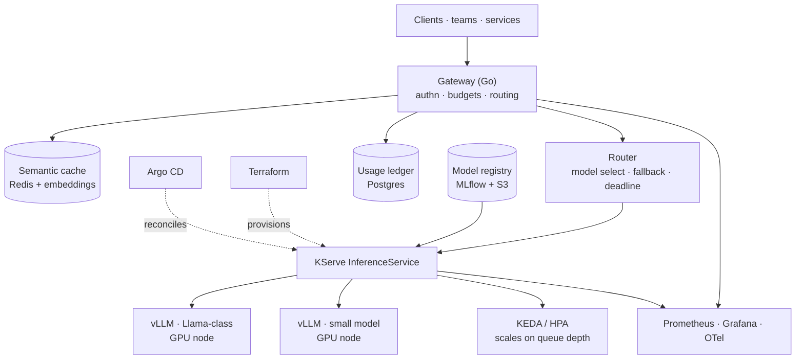

# TESSERA — LLM Inference Platform


**Serving open models at a cost you can actually state.**

*A multi-tenant inference gateway in Go — API keys, token budgets, rate limits, usage metering, and cost attribution enforced before the GPU. v0 is complete and runnable; vLLM on GPU nodes and autoscaling on queue depth are v1. Every number in this README is measured, not estimated — the unmeasured ones say so.*

[Architecture](#architecture) • [API walkthrough](api.md) • [RPD](docs/RPD.md) • [Engineering Design](docs/ENGINEERING.md) • [Benchmarks](docs/benchmarks.md) • [Runbook](docs/RUNBOOK.md)

---

## Project Status

> **v0 is complete.** The control plane — auth, tenancy, budgets, rate limiting, metering, resilient provider routing, metrics, and a runnable local stack — is built, tested, and benchmarked. GPU-side work (vLLM, KServe, autoscaling, semantic cache) is **v1**, scoped but deliberately not started; every number below the v0 line is measured, and everything unmeasured says so.

### What v0 ships

| Capability | State |
|---|---|
| `POST /v1/chat`, `/v1/chat/completions`, `/v1/completions` (JSON + SSE streaming) | Done |
| API-key authentication and tenant identity | Done |
| Per-tenant token budgets, enforced before inference | Done |
| Per-tenant rate limiting and a global concurrency ceiling | Done |
| Usage metering and cost attribution via `GET /v1/usage` | Done |
| Pluggable stores: in-memory or PostgreSQL + Redis | Done |
| Provider layer: canned, OpenAI-compatible upstream, retry/timeout wrapper | Done |
| Prometheus metrics at `/metrics`, including request latency and TTFT | Done |
| Browser playground, `openapi.json`, and the `tesserac` CLI client | Done |
| Docker image, Compose stack, Kubernetes manifest (`deploy/k8s/v0.yaml`) | Done |
| Chaos exercises (Redis, model, PostgreSQL, SIGTERM) and an e2e smoke test | Done |
| Load runner (`bench/`) with a published control-plane sample | Done |

### What is v1 (not started, by design)

| Capability | Why it waits |
|---|---|
| Terraform GPU node pool | Needs a funded GPU environment |
| vLLM deployment + KServe model registry | Same |
| Semantic cache (Redis + embeddings) | Only earns its complexity against a real model |
| Autoscaling on queue depth (KEDA) | Requires a real queue behind a real engine |
| Grafana dashboards and OTel traces | Metrics are exposed; visualization is v1 |
| Real-model TTFT, throughput, GPU cost, break-even | Unmeasured until hardware exists — see [`docs/benchmarks.md`](docs/benchmarks.md) |

## Run the local playground

The v0 playground can run entirely in memory for fast development, or with PostgreSQL, Redis, and the local mock model through Compose:

```bash
make run
```

Open [http://localhost:8080/playground](http://localhost:8080/playground) in a browser. The page contains a local demo API key and can send both normal and streaming requests. The machine-readable API contract is available at [http://localhost:8080/openapi.json](http://localhost:8080/openapi.json).

The local key, tenant, budget, and usage ledger reset whenever the gateway restarts. They are deliberately not production credentials.

The same playground can be exercised from the CLI:

```bash
key=$(curl -fsS http://localhost:8080/playground | sed -n 's/.*id="key" value="\([^"]*\)".*/\1/p')
go run ./cmd/tesserac -key "$key" -prompt "hello from the CLI"
go run ./cmd/tesserac -key "$key" -stream -prompt "stream from the CLI"
```

For the dependency-backed playground and its automated smoke test:

```bash
make compose-up
make e2e
```

Stop it with `make compose-down`.

Other targets: `make test` (race-enabled), `make build`, `make chaos` (failure exercises against the Compose stack), `make bench` (load runner), and `make real-model` (point the gateway at a local model — see [`docs/LOCAL_MODEL.md`](docs/LOCAL_MODEL.md)).

### Configuration

Everything is environment-driven, with in-memory defaults so the binary runs with no dependencies at all:

| Variable | Default | Purpose |
|---|---|---|
| `TESSERA_ADDR` | `:8080` | Listen address |
| `TESSERA_LOG_LEVEL` | `info` | Structured log level |
| `TESSERA_STORAGE` | `memory` | `memory` or `postgres` |
| `TESSERA_DATABASE_URL` | — | PostgreSQL DSN; set it and Postgres is used for tenancy and the ledger |
| `TESSERA_REDIS_URL` | — | Redis URL; set it and budgets and rate limits move to Redis |
| `TESSERA_MODEL_URL` | — | OpenAI-compatible upstream; unset uses the canned provider |
| `TESSERA_MODEL_NAME` | `canned-local` | Model name reported back to the client |
| `TESSERA_MAX_CONCURRENT` | `32` | Global in-flight ceiling |
| `TESSERA_RATE_LIMIT_PER_SEC` / `_BURST` | `10` / `20` | Per-tenant token bucket |
| `TESSERA_TENANT_BUDGET` | `5000` | Tokens per tenant per period |
| `TESSERA_REQUEST_TIMEOUT_SEC` | `60` | Upstream request deadline |
| `TESSERA_COST_PER_MILLION` | `0` | USD per million tokens, used for cost attribution |

---

## What is TESSERA?

Running an LLM is easy. Running one for several teams, on hardware that costs more per hour than the engineer operating it, while answering "why was my request slow" and "what did my team spend" — that is the problem.

TESSERA is the layer between "a model is running" and "a model is a service other teams depend on." It answers four questions that a bare `vllm serve` cannot:

1. **Who is calling, and what are they allowed to spend?** Per-tenant API keys, token budgets, and rate limits enforced before the request reaches a GPU.
2. **What does this actually cost?** Cost attribution per tenant per million tokens, derived from measured GPU-hours and measured token counts — not from a pricing page.
3. **Why is it slow right now?** Time-to-first-token, inter-token latency, and queue wait are separate metrics, because "the model is slow" is not actionable and "queue depth is 40 because we're at max batch size" is.
4. **What happens when a GPU node dies mid-stream?** In-flight requests fail cleanly with a typed error, the node drains, and the autoscaler replaces it. Streaming responses are not silently truncated.

### What this project builds, and what it buys

**Builds:** the gateway — authentication, per-tenant budgets, model routing with fallback, semantic caching, and the cost/latency telemetry that makes the platform operable.

**Buys:** everything else. vLLM does continuous batching and paged attention. KServe does model lifecycle and scale-to-zero. Kubernetes and the NVIDIA device plugin do GPU scheduling. Terraform provisions. Argo CD reconciles. Prometheus and Grafana observe.

Writing an inference engine would be a good way to understand paged attention and a bad way to serve a model. vLLM is the reference implementation; the interesting engineering is above it.

### Why not just use a hosted API?

That is often the correct answer, and this README says so plainly. TESSERA exists for the cases where it is not: data that cannot leave your network, sustained volume where per-token pricing exceeds owned-hardware cost, models that are not offered by a vendor, and latency floors a shared endpoint cannot meet. **The break-even analysis is a deliverable of this project, published in `docs/benchmarks.md`** — including the volume below which self-hosting loses.

---

## Architecture



**Built in v0:** the gateway, the usage ledger, the metrics surface, and the router's model-selection/fallback seam — with an OpenAI-compatible upstream standing in for vLLM (the mock model locally, any compatible endpoint in Compose or Kubernetes).

**Left for v1:** everything downstream of the router — KServe, vLLM on GPU nodes, the model registry, KEDA autoscaling, and the semantic cache.

---

## The Request Path

```
POST /v1/chat/completions
   ↓
Authenticate            tenant API key → tenant identity
   ↓
Rate limit              per-tenant token bucket + global concurrency ceiling
   ↓
Budget check            tokens remaining this period; 429 with reset time if exhausted
   ↓
Semantic cache          embed prompt → vector lookup; hit returns immediately   [v1]
   ↓
Route                   model class + deadline → target InferenceService
   ↓                    (small model first where quality permits, escalate on failure)
vLLM                    continuous batching; stream tokens back
   ↓
Meter                   prompt + completion tokens → usage ledger
   ↓
Respond                 stream + trailer with usage, cache status, model served
```

Two properties worth naming:

**Budgets are enforced before the GPU, not after.** A tenant over budget costs a Redis lookup, not an inference. This is the difference between a rate limiter and a cost control.

**The response reports which model served it.** Fallback routing that silently downgrades quality is a support ticket waiting to happen. The trailer states the model, whether the cache was hit, and the token counts used for billing.

---

## Cost and Latency — the actual deliverable

These are the numbers this project exists to produce. v0 measured what a control plane can measure without a GPU; the rest stays empty rather than estimated.

**Measured — v0 control plane** (Compose stack, mock upstream, 10 requests at concurrency 10; full method and environment in [`docs/benchmarks.md`](docs/benchmarks.md)):

| Measurement | Result |
|---|---|
| Gateway overhead, JSON, p50 / p95 | 28.5 ms / 43.0 ms |
| Gateway overhead, SSE, p50 / p95 | 34.2 ms / 53.1 ms |
| Time to first token, SSE, p50 / p95 | 32.8 ms / 51.2 ms |
| Success rate, both modes | 10/10 |

This is gateway cost, not inference performance — the upstream returns immediately.

**Unmeasured — needs a GPU environment (v1):**

| Measurement | Target | Measured |
|---|---|---|
| Time to first token, real model, p50 / p99 | < 300ms / < 1s | — |
| Inter-token latency, p99 | < 50ms | — |
| Throughput at max batch, tokens/sec | — | — |
| GPU utilization under sustained load | > 70% | — |
| Cost per 1M tokens (owned hardware, measured) | — | — |
| Break-even volume vs hosted API | — | — |
| Semantic cache hit rate | > 20% | — |
| Cost saved by cache, per month | — | — |
| Scale-from-zero cold start | < 90s | — |

The batch-size vs throughput vs TTFT curve is the central artifact — it is the tradeoff every inference platform makes and almost nobody publishes for their own workload.

---

## Service Level Objectives

These are the operating contract for when TESSERA runs as a live service. v0 is a complete, runnable build, not a hosted deployment — no uptime is claimed against these numbers yet.

| SLI | Definition | SLO |
|---|---|---|
| Availability | Non-5xx gateway responses ÷ total | 99.5% / 30d |
| Time to first token | p99, excluding queue at capacity | < 1s |
| Queue wait | p95, request accepted → batch entry | < 500ms |
| Streaming integrity | Streams completed ÷ streams started | 99.9% |
| Budget enforcement | Requests served over budget | 0 |

Deliberately *not* 99.9% availability. GPU capacity is finite and expensive; an honest SLO with headroom beats an aspirational one that the error budget breaches every month.

---

## Metrics

Exposed today at `/metrics` in Prometheus text format:

| Metric | Type | Question it answers |
|---|---|---|
| `tessera_request_latency_seconds` | histogram | How long does a full request take? |
| `tessera_ttft_seconds` | histogram | Is the first token slow, or the whole response? |
| `tessera_requests_total` / `tessera_completed_total` | counter | How many arrived, how many finished? |
| `tessera_input_tokens_total` / `tessera_output_tokens_total` | counter | What is being consumed? |
| `tessera_budget_rejections_total` | counter | Who is hitting their ceiling? |
| `tessera_rate_limited_total` | counter | Who is being throttled? |
| `tessera_saturated_total` | counter | How often is the concurrency ceiling reached? |

Per-tenant cost and token totals are queryable through `GET /v1/usage`, backed by the PostgreSQL ledger.

Planned for v1, once a real engine is behind the router: `tessera_inter_token_seconds`, `tessera_queue_wait_seconds`, `tessera_batch_size`, `tessera_gpu_utilization`, `tessera_kv_cache_usage_ratio`, `tessera_semantic_cache_hits_total`, `tessera_fallback_total`, plus tenant/model labels on the existing series.

`tessera_kv_cache_usage_ratio` is the one to alert on when it lands. When vLLM's KV cache fills, it preempts and recomputes — latency degrades before throughput does, so this leads the incident rather than trailing it.

---

## Failure Modes

| Failure | Blast radius | Detection | Mitigation |
|---|---|---|---|
| GPU node dies mid-stream | In-flight requests on that node | Readiness probe | Typed error to client (never a truncated stream); node drains; autoscaler replaces |
| KV cache exhaustion | Latency across the model | `kv_cache_usage_ratio` | Admission control at threshold; queue rather than preempt |
| Model fails to load after deploy | One model | KServe readiness | Previous revision keeps serving; rollout halts |
| Tenant floods the gateway | Potentially all tenants | Per-tenant rate metric | Token bucket per tenant; fair queueing across tenants |
| Redis unavailable | Cache and budgets | Health check | Cache degrades to miss (safe); budgets **fail closed** — reject rather than serve unbilled |
| Registry unreachable | New deploys only | Pull failure | Running models unaffected; deploy fails before traffic shift |
| Scale-to-zero cold start | First request after idle | Cold-start metric | Documented; minimum replica 1 for latency-sensitive models |
| Prompt injection via cached response | Cross-tenant leakage | — | **Cache is namespaced per tenant.** No cross-tenant cache sharing, ever |

The last row is a security property, not a performance one, and it is the reason the semantic cache will be keyed on `(tenant, embedding)` rather than embedding alone.

Four of these are exercised as executable checks in v0 via `make chaos`: Redis loss (budgets fail closed with 503), model-upstream loss (typed failure, no truncated stream), PostgreSQL loss (usage fails closed), and SIGTERM (graceful shutdown and recovery). The GPU, KV-cache, registry, and cold-start rows belong to v1.

---

## Tech Stack

| Layer | Technology | Why |
|---|---|---|
| **Inference** | vLLM | Continuous batching and paged attention — the reference implementation |
| **Serving lifecycle** | KServe | Model versioning, canary revisions, scale-to-zero |
| **Autoscaling** | KEDA on queue depth | CPU-based autoscaling is meaningless for GPU inference |
| **Gateway** | Go | Streaming proxy, low overhead, one static binary |
| **Cache + budgets** | Redis | Vector similarity for semantic cache; token buckets for budgets |
| **Usage ledger** | PostgreSQL | Billing data needs transactions, not a time series |
| **Model registry** | MLflow + S3 | Versioned artifacts with lineage |
| **GPU scheduling** | Kubernetes + NVIDIA device plugin | Standard, and what employers run |
| **Provisioning** | Terraform | GPU node pools as code, including spot/preemptible policy |
| **Delivery** | Argo CD | GitOps reconciliation |
| **Observability** | Prometheus · Grafana · OpenTelemetry | Traces span gateway → KServe → vLLM |

In v0 the gateway, Redis, PostgreSQL, Go, Docker, and Kubernetes rows are live; vLLM, KServe, KEDA, MLflow, Terraform, Argo CD, Grafana, and OTel are v1 commitments. An OpenAI-compatible HTTP upstream sits where vLLM will, so the swap is a config change (`TESSERA_MODEL_URL`), not a rewrite.

---

## Non-Goals

- **Not a model trainer.** Serving only. Fine-tuning is a different system with different hardware economics.
- **Not an inference engine.** vLLM is better than anything written here would be.
- **Not a RAG framework.** Retrieval lives in [LATTICE](https://github.com/nickemma/lattice); TESSERA serves the model that consumes it.
- **Not a hosted-API replacement in general.** It wins above a measured volume threshold, published in the benchmarks.
- **Not multi-cloud.** One provider, one region, until an SLO says otherwise.

---

## Documentation

| Document | Contents |
|---|---|
| [`docs/RPD.md`](docs/RPD.md) | Requirements, acceptance criteria, build order |
| [`docs/ENGINEERING.md`](docs/ENGINEERING.md) | Design, build-vs-buy decisions, GPU economics |
| [`docs/benchmarks.md`](docs/benchmarks.md) | Method, batch/throughput/TTFT curves, cost, break-even |
| [`docs/RUNBOOK.md`](docs/RUNBOOK.md) | "Inference is slow" and other 2am procedures |
| [`docs/THREAT_MODEL.md`](docs/THREAT_MODEL.md) | Trust boundaries, key handling, tenant isolation |
| [`docs/INCIDENTS.md`](docs/INCIDENTS.md) | Incident log |
| [`docs/LOCAL_MODEL.md`](docs/LOCAL_MODEL.md) | Pointing the gateway at a real local model |
| [`docs/Progress.md`](docs/Progress.md) | Milestone log and build history |
| [`api.md`](api.md) | Step-by-step local API and end-to-end testing walkthrough |

---

## Author

**[@nickemma](https://github.com/nickemma)** — Building production-grade distributed systems, infrastructure, and platform engineering from first principles.

💼 Open to distributed systems, infrastructure, platform, and backend engineering roles at companies building serious systems.

<div align="center">
<a href="https://www.linkedin.com/in/techieemma/"></a>
<a href="https://twitter.com/techieemma"></a>
<a href="https://github.com/nickemma/"></a>
<a href="https://techieemma.medium.com/"></a>
<a href="mailto:nicholasemmanuel321@gmail.com"></a>
</div>

---

<div align="center">

**Building Systems, Building Faith — One Commit at a Time**

*Part of [The Nicholas Emmanuel Engineering Blueprint](https://github.com/nickemma/Nicholas-Engineering-Blueprint).*
