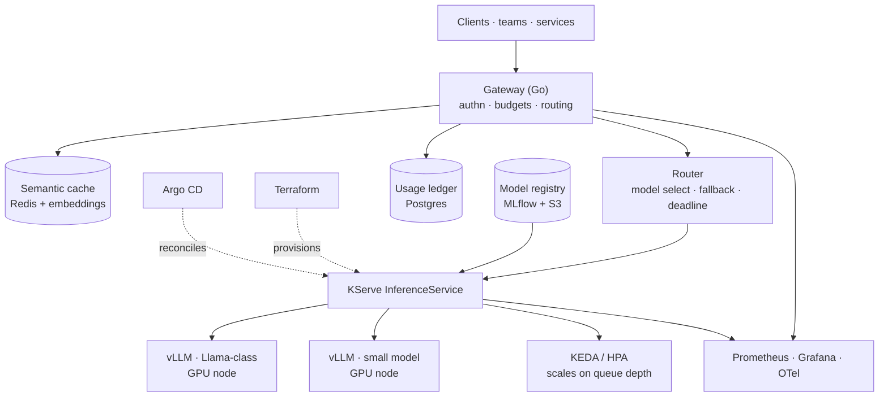

# TESSERA — LLM Inference Platform


**Serving open models at a cost you can actually state.**

*vLLM on GPU nodes. Multi-tenant gateway with token budgets. Autoscaling on queue depth, not CPU. Every number in this README is measured, not estimated.*

[Architecture](#architecture) • [RPD](docs/RPD.md) • [Engineering Design](docs/ENGINEERING.md) • [Benchmarks](docs/benchmarks.md) • [Runbook](docs/RUNBOOK.md)

---

## Project Status

> **Design published, implementation starting.** Nothing is claimed as shipped unless the table says so. Every benchmark cell reading `—` is unmeasured, and will not be filled with an estimate.

| Component | State |
|---|---|
| RPD, engineering design | Written |
| Terraform GPU node pool | Not started |
| vLLM deployment + model registry | Not started |
| Gateway: auth, token budgets, routing | Not started |
| Semantic cache | Not started |
| Autoscaling on queue depth | Not started |
| Observability: TTFT, tokens/sec, cost per tenant | Not started |
| Load + capacity report | Not started |

---

## What is TESSERA?

Running an LLM is easy. Running one for several teams, on hardware that costs more per hour than the engineer operating it, while answering "why was my request slow" and "what did my team spend" — that is the problem.

TESSERA is the layer between "a model is running" and "a model is a service other teams depend on." It answers four questions that a bare `vllm serve` cannot:

1. **Who is calling, and what are they allowed to spend?** Per-tenant API keys, token budgets, and rate limits enforced before the request reaches a GPU.
2. **What does this actually cost?** Cost attribution per tenant per million tokens, derived from measured GPU-hours and measured token counts — not from a pricing page.
3. **Why is it slow right now?** Time-to-first-token, inter-token latency, and queue wait are separate metrics, because "the model is slow" is not actionable and "queue depth is 40 because we're at max batch size" is.
4. **What happens when a GPU node dies mid-stream?** In-flight requests fail cleanly with a typed error, the node drains, and the autoscaler replaces it. Streaming responses are not silently truncated.

### What this project builds, and what it buys

**Builds:** the gateway — authentication, per-tenant budgets, model routing with fallback, semantic caching, and the cost/latency telemetry that makes the platform operable.

**Buys:** everything else. vLLM does continuous batching and paged attention. KServe does model lifecycle and scale-to-zero. Kubernetes and the NVIDIA device plugin do GPU scheduling. Terraform provisions. Argo CD reconciles. Prometheus and Grafana observe.

Writing an inference engine would be a good way to understand paged attention and a bad way to serve a model. vLLM is the reference implementation; the interesting engineering is above it.

### Why not just use a hosted API?

That is often the correct answer, and this README says so plainly. TESSERA exists for the cases where it is not: data that cannot leave your network, sustained volume where per-token pricing exceeds owned-hardware cost, models that are not offered by a vendor, and latency floors a shared endpoint cannot meet. **The break-even analysis is a deliverable of this project, published in `docs/benchmarks.md`** — including the volume below which self-hosting loses.

---

## Architecture



---

## The Request Path

```
POST /v1/chat/completions
   ↓
Authenticate            tenant API key → tenant identity
   ↓
Budget check            tokens remaining this period; 429 with reset time if exhausted
   ↓
Semantic cache          embed prompt → vector lookup; hit returns immediately
   ↓
Route                   model class + deadline → target InferenceService
   ↓                    (small model first where quality permits, escalate on failure)
vLLM                    continuous batching; stream tokens back
   ↓
Meter                   prompt + completion tokens → usage ledger
   ↓
Respond                 stream + trailer with usage, cache status, model served
```

Two properties worth naming:

**Budgets are enforced before the GPU, not after.** A tenant over budget costs a Redis lookup, not an inference. This is the difference between a rate limiter and a cost control.

**The response reports which model served it.** Fallback routing that silently downgrades quality is a support ticket waiting to happen. The trailer states the model, whether the cache was hit, and the token counts used for billing.

---

## Cost and Latency — the actual deliverable

These are the numbers this project exists to produce. **All cells are unmeasured until the load test runs.**

| Measurement | Target | Measured |
|---|---|---|
| Time to first token, p50 / p99 | < 300ms / < 1s | — |
| Inter-token latency, p99 | < 50ms | — |
| Throughput at max batch, tokens/sec | — | — |
| GPU utilization under sustained load | > 70% | — |
| Cost per 1M tokens (owned hardware, measured) | — | — |
| Break-even volume vs hosted API | — | — |
| Semantic cache hit rate | > 20% | — |
| Cost saved by cache, per month | — | — |
| Scale-from-zero cold start | < 90s | — |

The batch-size vs throughput vs TTFT curve is the central artifact — it is the tradeoff every inference platform makes and almost nobody publishes for their own workload.

---

## Service Level Objectives

| SLI | Definition | SLO |
|---|---|---|
| Availability | Non-5xx gateway responses ÷ total | 99.5% / 30d |
| Time to first token | p99, excluding queue at capacity | < 1s |
| Queue wait | p95, request accepted → batch entry | < 500ms |
| Streaming integrity | Streams completed ÷ streams started | 99.9% |
| Budget enforcement | Requests served over budget | 0 |

Deliberately *not* 99.9% availability. GPU capacity is finite and expensive; an honest SLO with headroom beats an aspirational one that the error budget breaches every month.

---

## Metrics

| Metric | Type | Labels | Question it answers |
|---|---|---|---|
| `tessera_ttft_seconds` | histogram | model, tenant | Is the first token slow, or the whole response? |
| `tessera_inter_token_seconds` | histogram | model | Is generation slow once started? |
| `tessera_queue_wait_seconds` | histogram | model | Are we capacity-bound? |
| `tessera_batch_size` | histogram | model | Is continuous batching filling? |
| `tessera_gpu_utilization` | gauge | node, gpu | Are we paying for idle silicon? |
| `tessera_kv_cache_usage_ratio` | gauge | model | Are we about to preempt requests? |
| `tessera_tokens_total` | counter | tenant, model, kind | What is each tenant consuming? |
| `tessera_cost_usd_total` | counter | tenant, model | What does each tenant owe? |
| `tessera_semantic_cache_hits_total` | counter | tenant | Is the cache earning its complexity? |
| `tessera_budget_rejections_total` | counter | tenant | Who is hitting their ceiling? |
| `tessera_fallback_total` | counter | from_model, to_model, reason | How often is quality being downgraded? |

`tessera_kv_cache_usage_ratio` is the one to alert on. When vLLM's KV cache fills, it preempts and recomputes — latency degrades before throughput does, so this leads the incident rather than trailing it.

---

## Failure Modes

| Failure | Blast radius | Detection | Mitigation |
|---|---|---|---|
| GPU node dies mid-stream | In-flight requests on that node | Readiness probe | Typed error to client (never a truncated stream); node drains; autoscaler replaces |
| KV cache exhaustion | Latency across the model | `kv_cache_usage_ratio` | Admission control at threshold; queue rather than preempt |
| Model fails to load after deploy | One model | KServe readiness | Previous revision keeps serving; rollout halts |
| Tenant floods the gateway | Potentially all tenants | Per-tenant rate metric | Token bucket per tenant; fair queueing across tenants |
| Redis unavailable | Cache and budgets | Health check | Cache degrades to miss (safe); budgets **fail closed** — reject rather than serve unbilled |
| Registry unreachable | New deploys only | Pull failure | Running models unaffected; deploy fails before traffic shift |
| Scale-to-zero cold start | First request after idle | Cold-start metric | Documented; minimum replica 1 for latency-sensitive models |
| Prompt injection via cached response | Cross-tenant leakage | — | **Cache is namespaced per tenant.** No cross-tenant cache sharing, ever |

The last row is a security property, not a performance one, and it is the reason the semantic cache is keyed on `(tenant, embedding)` rather than embedding alone.

---

## Tech Stack

| Layer | Technology | Why |
|---|---|---|
| **Inference** | vLLM | Continuous batching and paged attention — the reference implementation |
| **Serving lifecycle** | KServe | Model versioning, canary revisions, scale-to-zero |
| **Autoscaling** | KEDA on queue depth | CPU-based autoscaling is meaningless for GPU inference |
| **Gateway** | Go | Streaming proxy, low overhead, one static binary |
| **Cache + budgets** | Redis | Vector similarity for semantic cache; token buckets for budgets |
| **Usage ledger** | PostgreSQL | Billing data needs transactions, not a time series |
| **Model registry** | MLflow + S3 | Versioned artifacts with lineage |
| **GPU scheduling** | Kubernetes + NVIDIA device plugin | Standard, and what employers run |
| **Provisioning** | Terraform | GPU node pools as code, including spot/preemptible policy |
| **Delivery** | Argo CD | GitOps reconciliation |
| **Observability** | Prometheus · Grafana · OpenTelemetry | Traces span gateway → KServe → vLLM |

---

## Non-Goals

- **Not a model trainer.** Serving only. Fine-tuning is a different system with different hardware economics.
- **Not an inference engine.** vLLM is better than anything written here would be.
- **Not a RAG framework.** Retrieval lives in [LATTICE](https://github.com/nickemma/lattice); TESSERA serves the model that consumes it.
- **Not a hosted-API replacement in general.** It wins above a measured volume threshold, published in the benchmarks.
- **Not multi-cloud.** One provider, one region, until an SLO says otherwise.

---

## Documentation

| Document | Contents |
|---|---|
| [`docs/RPD.md`](docs/RPD.md) | Requirements, acceptance criteria, build order |
| [`docs/ENGINEERING.md`](docs/ENGINEERING.md) | Design, build-vs-buy decisions, GPU economics |
| [`docs/benchmarks.md`](docs/benchmarks.md) | Method, batch/throughput/TTFT curves, cost, break-even |
| [`docs/RUNBOOK.md`](docs/RUNBOOK.md) | "Inference is slow" and other 2am procedures |
| [`docs/adr/`](docs/adr) | Decisions and the alternatives that lost |

---

## Author

**[@nickemma](https://github.com/nickemma)** — Building production-grade distributed systems, infrastructure, and platform engineering from first principles.

💼 Open to distributed systems, infrastructure, platform, and backend engineering roles at companies building serious systems.

<div align="center">
<a href="https://www.linkedin.com/in/techieemma/"></a>
<a href="https://twitter.com/techieemma"></a>
<a href="https://github.com/nickemma/"></a>
<a href="https://techieemma.medium.com/"></a>
<a href="mailto:nicholasemmanuel321@gmail.com"></a>
</div>

---

<div align="center">

**Building Systems, Building Faith — One Commit at a Time**

*Part of [The Nicholas Emmanuel Engineering Blueprint](https://github.com/nickemma/Nicholas-Engineering-Blueprint).*
